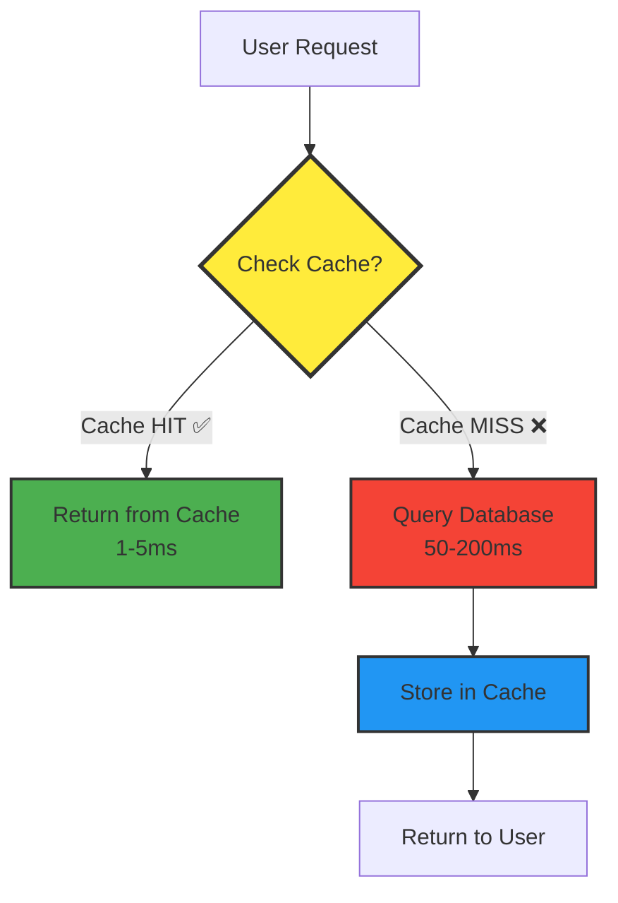

# Caching: The Secret to Fast Applications

*Last Updated: December 2024*

---

## 🧒 **Explain Like I'm 5**

**Imagine you love reading the same story book every night before bed.**

**Without caching:**
- Every night, you walk to the library 🏃
- Find the book on the shelf 📚
- Walk back home 🏃
- Read the story ✅
- **This takes 30 minutes!**

**With caching:**
- First night: Get the book from library (30 minutes)
- Keep the book under your pillow! 🛏️
- Every other night: Just grab it from your pillow (5 seconds!)
- **You saved SO MUCH time!**

**That's caching!** Instead of getting data from a slow place (library/database) every time, we keep a copy in a fast place (pillow/memory) and reuse it!

---

## 📋 **What is Caching?**

Caching is storing frequently accessed data in a faster storage layer (cache) to reduce latency and load on the primary data source.

### **The Speed Hierarchy:**

```
┌─────────────────────────────────────────┐
│ CPU Cache (L1/L2/L3)                    │  << Nanoseconds
├─────────────────────────────────────────┤
│ RAM (Memory)                            │  << Microseconds  
├─────────────────────────────────────────┤
│ In-Memory Cache (Redis, Memcached)     │  << Milliseconds (1-5ms)
├─────────────────────────────────────────┤
│ SSD Database                            │  << Milliseconds (10-50ms)
├─────────────────────────────────────────┤
│ HDD Database                            │  << Milliseconds (50-200ms)
├─────────────────────────────────────────┤
│ Network Call (API, Database)           │  << Milliseconds (100-1000ms)
└─────────────────────────────────────────┘

Cache = Using faster storage to avoid slower storage!
```

---

## 🎯 **Why Caching Matters**

### **Real-World Impact:**

**Before Caching:**
```
User requests page
    → Query database (100ms)
    → Process data (50ms)
    → Return response
Total: 150ms per request

1,000 requests/sec = 150,000ms = Database overload! 💥
```

**After Caching:**
```
User requests page
    → Check cache (1ms) ✅ Found!
    → Return response
Total: 1ms per request

1,000 requests/sec = 1,000ms = Easy! 😊

Cache hit rate: 90%
→ Only 100 requests hit database
→ Database handles it easily!
```

### **Benefits:**

```
┌────────────────────────────────────────┐
│ ⚡ Reduced Latency                     │
│    100ms → 1ms (100x faster!)          │
├────────────────────────────────────────┤
│ 📉 Lower Database Load                 │
│    90% cache hits = 10x less DB load   │
├────────────────────────────────────────┤
│ 💰 Cost Savings                        │
│    Fewer database queries = lower cost │
├────────────────────────────────────────┤
│ 🚀 Better User Experience              │
│    Pages load instantly                │
├────────────────────────────────────────┤
│ 📈 Scalability                         │
│    Handle 10x more traffic             │
└────────────────────────────────────────┘
```

---

## 📊 **Visual Architecture**



---

## 🏗️ **Types of Caching**

### **1. Client-Side Caching**

**Kid-friendly:** "Your phone remembers the app instead of downloading it every time"

**Examples:**
- Browser cache (images, CSS, JavaScript)
- Mobile app cache
- DNS cache

```javascript
// Browser caching with HTTP headers
res.setHeader('Cache-Control', 'public, max-age=3600'); // Cache for 1 hour
res.setHeader('ETag', 'abc123'); // Version identifier
```

---

### **2. CDN Caching**

**Kid-friendly:** "Pizza shops in every neighborhood instead of one shop far away"

**Examples:**
- CloudFront (AWS)
- Cloudflare
- Akamai

```
Without CDN:
User in Tokyo → Server in USA (200ms latency)

With CDN:
User in Tokyo → Tokyo CDN (10ms latency) ✅
```

---

### **3. Application-Level Caching**

**Kid-friendly:** "Remember the answer in your brain instead of looking in the book"

**In-Memory Cache:**
```javascript
// Simple in-memory cache
const cache = new Map();

function getUser(userId) {
  // Check cache first
  if (cache.has(userId)) {
    console.log('Cache HIT! ✅');
    return cache.get(userId);
  }
  
  // Cache miss - fetch from database
  console.log('Cache MISS! ❌');
  const user = database.query('SELECT * FROM users WHERE id = ?', userId);
  
  // Store in cache for next time
  cache.set(userId, user);
  
  return user;
}
```

---

### **4. Distributed Caching (Redis, Memcached)**

**Kid-friendly:** "Shared notepad that all your friends can read from"

**Why distributed?**
- Multiple servers share the same cache
- Cache survives server restarts (Redis persistence)
- Can scale cache independently

```javascript
// Redis caching
import Redis from 'redis';

const redis = Redis.createClient();

async function getUserWithCache(userId) {
  const cacheKey = `user:${userId}`;
  
  // Try cache first
  const cached = await redis.get(cacheKey);
  if (cached) {
    console.log('Redis HIT! ✅');
    return JSON.parse(cached);
  }
  
  // Fetch from database
  console.log('Redis MISS! ❌');
  const user = await database.getUser(userId);
  
  // Store in Redis (expire in 1 hour)
  await redis.setex(cacheKey, 3600, JSON.stringify(user));
  
  return user;
}
```

---

### **5. Database Query Caching**

**Kid-friendly:** "The library remembers popular books for quick access"

```sql
-- PostgreSQL query result caching
-- Database automatically caches frequently executed queries
SELECT * FROM products WHERE category = 'electronics';
```

---

## ⚖️ **Cache Eviction Policies**

**Kid-friendly:** "When your toy box is full, which toys do you throw away?"

### **LRU (Least Recently Used)** ⭐ Most Common

**Rule:** Remove item that hasn't been used for longest time

```
Cache (capacity: 3):
├── Item A (used 5 min ago)
├── Item B (used 10 min ago)  ← Remove this one!
└── Item C (used 2 min ago)

New item arrives → Kick out Item B
```

**Code Example:**
```javascript
class LRUCache {
  constructor(capacity) {
    this.capacity = capacity;
    this.cache = new Map(); // Maintains insertion order
  }
  
  get(key) {
    if (!this.cache.has(key)) return null;
    
    // Move to end (mark as recently used)
    const value = this.cache.get(key);
    this.cache.delete(key);
    this.cache.set(key, value);
    
    return value;
  }
  
  put(key, value) {
    // Remove if exists
    if (this.cache.has(key)) {
      this.cache.delete(key);
    }
    
    // Add to end
    this.cache.set(key, value);
    
    // Evict oldest if over capacity
    if (this.cache.size > this.capacity) {
      const firstKey = this.cache.keys().next().value;
      this.cache.delete(firstKey);
      console.log(`Evicted: ${firstKey}`);
    }
  }
}

// Usage
const cache = new LRUCache(3);
cache.put('user:1', {name: 'Alice'});
cache.put('user:2', {name: 'Bob'});
cache.put('user:3', {name: 'Charlie'});
cache.put('user:4', {name: 'David'}); // Evicts user:1
```

---

### **LFU (Least Frequently Used)**

**Rule:** Remove item used least often

```
Cache:
├── Item A (accessed 100 times)
├── Item B (accessed 5 times)  ← Remove this one!
└── Item C (accessed 50 times)
```

---

### **FIFO (First In, First Out)**

**Rule:** Remove oldest item (like a queue)

```
Cache:
├── Item A (added first)  ← Remove this one!
├── Item B (added second)
└── Item C (added third)
```

---

### **TTL (Time To Live)**

**Rule:** Remove items after a certain time

```javascript
// Redis with TTL
await redis.setex('session:abc123', 3600, data); // Expires in 1 hour

// After 1 hour: ☠️ Automatically deleted
```

---

## 🔄 **Cache Update Strategies**

### **1. Cache-Aside (Lazy Loading)** ⭐ Most Common

**Kid-friendly:** "Only get the book when you actually need it"

```javascript
async function getData(key) {
  // 1. Try cache
  let data = await cache.get(key);
  
  if (data) {
    return data; // Cache hit ✅
  }
  
  // 2. Cache miss - fetch from DB
  data = await database.get(key);
  
  // 3. Store in cache
  await cache.set(key, data, 3600);
  
  return data;
}
```

**Flow:**
```
Read Request
    ↓
Check Cache → HIT? Return ✅
    ↓ MISS
Query Database
    ↓
Update Cache
    ↓
Return Data
```

**Pros:**
- ✅ Only cache what's actually used
- ✅ Cache failures don't break app (just slower)

**Cons:**
- ⚠️ First request is always slow (cold start)
- ⚠️ Cache and DB can get out of sync

---

### **2. Write-Through**

**Kid-friendly:** "Update both your notebook AND the teacher's book at the same time"

```javascript
async function updateData(key, value) {
  // 1. Write to database
  await database.set(key, value);
  
  // 2. Write to cache
  await cache.set(key, value);
  
  return value;
}
```

**Flow:**
```
Write Request
    ↓
Write to Database ✅
    ↓
Write to Cache ✅
    ↓
Return Success
```

**Pros:**
- ✅ Cache and DB always in sync
- ✅ Read requests always fast

**Cons:**
- ⚠️ Write operations slower (two writes)
- ⚠️ Wastes cache space (might cache unused data)

---

### **3. Write-Behind (Write-Back)**

**Kid-friendly:** "Take quick notes now, copy to official book later"

```javascript
async function updateData(key, value) {
  // 1. Write to cache immediately ⚡
  await cache.set(key, value);
  
  // 2. Queue database write for later
  queue.add({ key, value });
  
  return value; // Return fast!
}

// Background worker
setInterval(async () => {
  const items = queue.getAll();
  for (const item of items) {
    await database.set(item.key, item.value);
  }
}, 5000); // Batch write every 5 seconds
```

**Flow:**
```
Write Request
    ↓
Write to Cache ⚡ (Fast!)
    ↓
Queue DB Write
    ↓
Return Success
    ↓
[Later] Write to DB
```

**Pros:**
- ✅ Super fast writes
- ✅ Batching reduces DB load

**Cons:**
- ⚠️ Data loss risk (if cache crashes before DB write)
- ⚠️ More complex

---

### **4. Refresh-Ahead**

**Kid-friendly:** "Prepare tomorrow's lunch today so it's ready when you need it"

```javascript
async function refreshAheadCache(key) {
  const data = await cache.get(key);
  const ttl = await cache.ttl(key);
  
  // If TTL < 10% remaining, refresh proactively
  if (ttl < 360) { // Less than 6 minutes (of 1 hour)
    // Refresh in background
    refreshInBackground(key);
  }
  
  return data;
}

async function refreshInBackground(key) {
  const fresh = await database.get(key);
  await cache.set(key, fresh, 3600);
}
```

**Pros:**
- ✅ No cache misses for popular items
- ✅ Always fast responses

**Cons:**
- ⚠️ Wasted refreshes if data not accessed again
- ⚠️ More complex logic

---

## 💻 **Production-Ready Caching Implementation**

### **Complete Redis Caching Service**

```javascript
import Redis from 'redis';

class CacheService {
  constructor() {
    this.redis = Redis.createClient({
      host: process.env.REDIS_HOST,
      port: process.env.REDIS_PORT,
      password: process.env.REDIS_PASSWORD,
      retry_strategy: (options) => {
        if (options.error && options.error.code === 'ECONNREFUSED') {
          return new Error('Redis connection refused');
        }
        if (options.total_retry_time > 1000 * 60 * 60) {
          return new Error('Retry time exhausted');
        }
        if (options.attempt > 10) {
          return undefined; // Stop retrying
        }
        return Math.min(options.attempt * 100, 3000);
      }
    });
    
    this.redis.on('error', (err) => console.error('Redis Error:', err));
    this.redis.on('connect', () => console.log('Redis Connected'));
  }

  /**
   * Get from cache with fallback to database
   */
  async get(key, fetchFunction, ttl = 3600) {
    try {
      // Try cache first
      const cached = await this.redis.get(key);
      
      if (cached) {
        this.logHit(key);
        return JSON.parse(cached);
      }
      
      // Cache miss - fetch from source
      this.logMiss(key);
      const data = await fetchFunction();
      
      if (data !== null && data !== undefined) {
        await this.set(key, data, ttl);
      }
      
      return data;
      
    } catch (error) {
      console.error('Cache get error:', error);
      // Fallback to database if cache fails
      return await fetchFunction();
    }
  }

  /**
   * Set value in cache
   */
  async set(key, value, ttl = 3600) {
    try {
      const serialized = JSON.stringify(value);
      
      if (ttl) {
        await this.redis.setex(key, ttl, serialized);
      } else {
        await this.redis.set(key, serialized);
      }
      
    } catch (error) {
      console.error('Cache set error:', error);
      // Fail silently - don't break the app
    }
  }

  /**
   * Delete from cache
   */
  async delete(key) {
    try {
      await this.redis.del(key);
    } catch (error) {
      console.error('Cache delete error:', error);
    }
  }

  /**
   * Delete multiple keys by pattern
   */
  async deletePattern(pattern) {
    try {
      const keys = await this.redis.keys(pattern);
      if (keys.length > 0) {
        await this.redis.del(...keys);
      }
      return keys.length;
    } catch (error) {
      console.error('Cache delete pattern error:', error);
      return 0;
    }
  }

  /**
   * Get multiple keys at once
   */
  async mget(keys) {
    try {
      const values = await this.redis.mget(keys);
      return values.map(v => v ? JSON.parse(v) : null);
    } catch (error) {
      console.error('Cache mget error:', error);
      return keys.map(() => null);
    }
  }

  /**
   * Increment counter (useful for rate limiting)
   */
  async increment(key, ttl = null) {
    try {
      const value = await this.redis.incr(key);
      
      if (ttl && value === 1) {
        await this.redis.expire(key, ttl);
      }
      
      return value;
    } catch (error) {
      console.error('Cache increment error:', error);
      return 0;
    }
  }

  /**
   * Cache statistics
   */
  logHit(key) {
    // Send to monitoring (Datadog, CloudWatch, etc.)
    console.log(`Cache HIT: ${key}`);
  }

  logMiss(key) {
    console.log(`Cache MISS: ${key}`);
  }

  /**
   * Get cache stats
   */
  async getStats() {
    try {
      const info = await this.redis.info();
      return {
        connected: true,
        info: info
      };
    } catch (error) {
      return {
        connected: false,
        error: error.message
      };
    }
  }
}

// Usage Example
const cache = new CacheService();

// Get user with caching
async function getUser(userId) {
  return await cache.get(
    `user:${userId}`,
    async () => {
      // Fetch from database if not in cache
      return await database.users.findById(userId);
    },
    3600 // Cache for 1 hour
  );
}

// Update user and invalidate cache
async function updateUser(userId, data) {
  await database.users.update(userId, data);
  await cache.delete(`user:${userId}`); // Invalidate cache
}

// Get multiple users efficiently
async function getUsers(userIds) {
  const keys = userIds.map(id => `user:${id}`);
  const cached = await cache.mget(keys);
  
  // Fetch missing users from DB
  const missing = [];
  cached.forEach((user, index) => {
    if (!user) {
      missing.push(userIds[index]);
    }
  });
  
  if (missing.length > 0) {
    const users = await database.users.findByIds(missing);
    // Cache them for next time
    for (const user of users) {
      await cache.set(`user:${user.id}`, user, 3600);
    }
  }
  
  return cached;
}
```

---

## 🚧 **Common Challenges & Solutions**

### **Challenge 1: Cache Invalidation**

**Kid-friendly:** "How do you know when your book under the pillow is outdated?"

**The Problem:**
```
1. User A reads data → Cache stores it
2. User B updates data → Database updated
3. User A reads again → Cache returns OLD data! ❌
```

**Solutions:**

**Option A: Time-Based Expiration (TTL)**
```javascript
// Cache expires automatically after time
await cache.setex('user:123', 3600, data); // 1 hour TTL
```
**Pros:** Simple  
**Cons:** Might show stale data for up to TTL duration

**Option B: Invalidate on Write**
```javascript
async function updateUser(id, data) {
  await db.update(id, data);
  await cache.delete(`user:${id}`); // ⚠️ Remove from cache
}
```
**Pros:** Always fresh data  
**Cons:** Extra work on every write

**Option C: Cache Versioning**
```javascript
// Include version in cache key
const cacheKey = `user:${id}:v${version}`;
```

---

### **Challenge 2: Cache Stampede (Thundering Herd)**

**The Problem:**
```
Popular item expires at 12:00
    ↓
1000 requests at 12:00:01
    ↓
All see cache miss! ❌
    ↓
All query database simultaneously
    ↓
Database crashes! 💥
```

**Solution: Lock/Mutex Pattern**
```javascript
const locks = new Map();

async function getWithLock(key, fetchFn) {
  // Check cache
  let data = await cache.get(key);
  if (data) return data;
  
  // Check if someone else is already fetching
  if (locks.has(key)) {
    // Wait for them to finish
    await locks.get(key);
    return await cache.get(key); // Should be there now
  }
  
  // We're first - set lock
  const lock = new Promise(async (resolve) => {
    data = await fetchFn();
    await cache.set(key, data, 3600);
    resolve();
  });
  
  locks.set(key, lock);
  await lock;
  locks.delete(key);
  
  return data;
}
```

---

### **Challenge 3: Cache Memory Limits**

**The Problem:**
```
Cache size: 1GB
Trying to cache: 2GB of data
    ↓
What gets kicked out? 🤔
```

**Solution: Configure eviction policy**
```bash
# Redis configuration
maxmemory 1gb
maxmemory-policy allkeys-lru  # Use LRU eviction
```

**Available policies:**
- `allkeys-lru`: Evict least recently used (best for cache)
- `allkeys-lfu`: Evict least frequently used
- `volatile-lru`: Only evict keys with TTL set
- `allkeys-random`: Random eviction

---

### **Challenge 4: Cache Warm-up**

**The Problem:**
```
App restarts
    ↓
Cache is empty (cold start)
    ↓
First 1000 requests hit database ❌
    ↓
Slow response times
```

**Solution: Pre-populate cache**
```javascript
async function warmUpCache() {
  console.log('Warming up cache...');
  
  // Pre-cache popular items
  const popular = await db.query('SELECT * FROM products ORDER BY views DESC LIMIT 100');
  
  for (const product of popular) {
    await cache.set(`product:${product.id}`, product, 7200);
  }
  
  console.log('Cache warm-up complete!');
}

// Run on startup
warmUpCache();
```

---

## 💰 **Cost Considerations**

### **Redis Pricing (AWS ElastiCache, December 2024)**

```
┌──────────────────────┬─────────────┬──────────┐
│ Instance Type        │ Memory      │ $/month  │
├──────────────────────┼─────────────┼──────────┤
│ cache.t3.micro       │ 0.5 GB      │ $12      │
│ cache.t3.small       │ 1.3 GB      │ $24      │
│ cache.t3.medium      │ 3.1 GB      │ $48      │
│ cache.m5.large       │ 6.3 GB      │ $100     │
│ cache.r5.large       │ 12.9 GB     │ $150     │
└──────────────────────┴─────────────┴──────────┘
```

**ROI Calculation:**
```
Without cache:
- 1000 req/sec × 100ms DB time = 100 seconds of DB time per second
- Need larger database instance: $500/month

With cache (90% hit rate):
- 100 req/sec hit database
- Can use smaller DB: $100/month
- Redis cache: $48/month
- Total: $148/month

Savings: $500 - $148 = $352/month ✅
Plus: 10x better latency!
```

---

## 🤔 **Common Interview Questions**

### **Q1: Explain the different caching strategies**

**Answer:**
1. **Cache-Aside**: Check cache, if miss fetch from DB and populate cache
2. **Write-Through**: Write to DB and cache simultaneously
3. **Write-Behind**: Write to cache immediately, write to DB asynchronously
4. **Refresh-Ahead**: Proactively refresh popular items before expiry

**Best for most cases:** Cache-Aside (simple, safe, only cache what's used)

---

### **Q2: What's the difference between LRU and LFU?**

**Answer:**
- **LRU (Least Recently Used)**: Evicts item not accessed for longest time
- **LFU (Least Frequently Used)**: Evicts item accessed least often

**Example:**
```
Cache: [A: used 1 min ago, 100 times]
       [B: used 1 hour ago, 5 times]

LRU evicts: B (oldest access)
LFU evicts: B (least frequent)
```

**When to use:**
- LRU: General purpose (most common)
- LFU: When access frequency matters more than recency

---

### **Q3: How do you handle cache invalidation?**

**Answer:**
1. **TTL-based**: Set expiration time, cache auto-invalidates
2. **Event-driven**: Invalidate when data changes
3. **Pattern-based**: Delete related keys (e.g., `user:*` when user changes)
4. **Version-based**: Include version in cache key

**Best practice:** Combine TTL (safety net) with event-driven invalidation (immediate freshness)

---

### **Q4: How would you prevent cache stampede?**

**Answer:**
Use locking/mutex pattern:
1. First request acquires lock
2. Other requests wait for lock
3. First request fetches data and caches it
4. Other requests then read from cache

Alternative: Probabilistic early expiration (refresh before TTL expires)

---

### **Q5: Design a caching strategy for a social media feed**

**Answer:**
```javascript
// Multi-layer caching
async function getFeed(userId) {
  // Layer 1: User's own cache (personalized)
  const cacheKey = `feed:${userId}`;
  let feed = await cache.get(cacheKey);
  
  if (feed) return feed;
  
  // Layer 2: Cache individual posts
  const postIds = await getRecentPostIds(userId);
  const posts = await Promise.all(
    postIds.map(id => getCachedPost(id))
  );
  
  // Assemble feed
  feed = assembleFeed(posts, userId);
  
  // Cache assembled feed (short TTL for freshness)
  await cache.set(cacheKey, feed, 300); // 5 minutes
  
  return feed;
}

async function getCachedPost(postId) {
  return await cache.get(
    `post:${postId}`,
    () => db.getPost(postId),
    3600 // 1 hour
  );
}
```

**Strategy:**
- Individual posts: Long TTL (don't change often)
- Assembled feed: Short TTL (needs freshness)
- Invalidate post cache when post is updated

---

## 📊 **Key Metrics to Monitor**

```javascript
const metrics = {
  cacheHitRate: 0.85,        // 85% (aim for >80%)
  cacheHits: 8500,
  cacheMisses: 1500,
  avgCacheLatency: 2,        // ms
  avgDbLatency: 85,          // ms
  cacheMemoryUsage: 0.75,    // 75% of capacity
  evictions: 120,            // Items evicted per hour
  connectionPoolUsage: 0.60  // 60% of connections used
};

// Calculate savings
const dbCallsAvoided = metrics.cacheHits;
const timeSaved = dbCallsAvoided * (metrics.avgDbLatency - metrics.avgCacheLatency);
console.log(`Saved ${timeSaved/1000} seconds of DB time`);
```

---

## 🎯 **Key Takeaways**

✅ Caching reduces latency by 10-100x  
✅ LRU is the most common eviction policy  
✅ Cache-Aside is the safest strategy  
✅ Always handle cache failures gracefully  
✅ Monitor hit rate (aim for 80%+)  
✅ Cache invalidation is the hardest problem  
✅ TTL + event-driven invalidation = best practice  
✅ Prevent cache stampede with locking  

---

## 🚀 **Next Steps**

1. **Practice:** Implement LRU cache from scratch
2. **Try Redis:** Set up local Redis and test caching
3. **Read Next:** [Databases](../06-databases/README.md)
4. **Build:** Add caching to your existing project

---

## 📚 **Further Reading**

- [Redis Documentation](https://redis.io/documentation)
- [Memcached Wiki](https://github.com/memcached/memcached/wiki)
- [AWS ElastiCache Best Practices](https://aws.amazon.com/elasticache/resources/)

---

**Next Topic:** [Databases & Data Storage](../06-databases/README.md)  
**Previous:** [Load Balancing](./load-balancing.md)

---

*Questions or improvements? Open an issue or submit a PR!*
