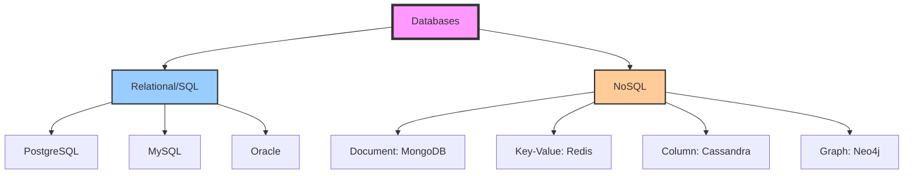

# Databases: The Foundation of Data Storage

*Last Updated: December 2024*

---

## 🧒 **Explain Like I'm 5**

**Imagine you have a huge toy collection!**

**Without a database:**
- Toys scattered everywhere 🧸
- Can't find your favorite car 🚗
- Don't know which toys you have
- Takes FOREVER to find anything

**With a database:**
- All toys organized in labeled boxes 📦
- Know exactly where each toy is
- Can quickly find "all red toys" or "all cars"
- **Finding toys is SUPER fast!**

**A database is like a super-organized toy box for computers!** Instead of toys, it stores information (like usernames, orders, messages) so programs can find and use it quickly.

---

## 📋 **What is a Database?**

A database is an organized collection of data that can be easily accessed, managed, and updated. It's the backbone of virtually every application you use.

### **Why Applications Need Databases:**

```
Without Database:
├── Data lost when app closes ❌
├── Can't share data between users ❌
├── No way to search or filter ❌
└── Everything in RAM (expensive!) ❌

With Database:
├── Data persists forever ✅
├── Multiple users access same data ✅
├── Fast searching and filtering ✅
└── Efficient storage on disk ✅
```

---

## 🎯 **Database Types Overview**



---

## 🗄️ **SQL (Relational) Databases**

### **The Concept**

**Kid-friendly:** "Like organized spreadsheets with strict rules"

**Technical:** Data stored in tables (rows and columns) with relationships between them.

### **Key Characteristics:**

```
┌─────────────────────────────────────────┐
│ ACID Compliance                         │
│ ─────────────────                       │
│ Atomicity: All or nothing               │
│ Consistency: Valid state always         │
│ Isolation: Transactions don't interfere │
│ Durability: Data survives crashes       │
└─────────────────────────────────────────┘

┌─────────────────────────────────────────┐
│ Schema-Based                            │
│ ─────────────────                       │
│ Must define structure before data       │
│ Every row follows same format           │
│ Changes require migrations              │
└─────────────────────────────────────────┘

┌─────────────────────────────────────────┐
│ Relationships                           │
│ ─────────────────                       │
│ Tables linked via foreign keys          │
│ JOINs connect related data              │
│ Referential integrity enforced          │
└─────────────────────────────────────────┘
```

### **Example Schema:**

```sql
-- Users table
CREATE TABLE users (
    id SERIAL PRIMARY KEY,
    username VARCHAR(50) UNIQUE NOT NULL,
    email VARCHAR(100) UNIQUE NOT NULL,
    created_at TIMESTAMP DEFAULT NOW()
);

-- Posts table (related to users)
CREATE TABLE posts (
    id SERIAL PRIMARY KEY,
    user_id INTEGER REFERENCES users(id),
    title VARCHAR(200) NOT NULL,
    content TEXT,
    created_at TIMESTAMP DEFAULT NOW()
);

-- Comments table (related to posts and users)
CREATE TABLE comments (
    id SERIAL PRIMARY KEY,
    post_id INTEGER REFERENCES posts(id),
    user_id INTEGER REFERENCES users(id),
    content TEXT NOT NULL,
    created_at TIMESTAMP DEFAULT NOW()
);
```

**Visual Relationship:**
```
users
  ├── id: 1, username: "alice"
  │   └── posts
  │       ├── id: 101, title: "My First Post"
  │       │   └── comments
  │       │       ├── id: 501, content: "Great post!"
  │       │       └── id: 502, content: "Thanks for sharing"
  │       └── id: 102, title: "Another Post"
  └── id: 2, username: "bob"
```

### **Common Queries:**

```sql
-- Find user with all their posts
SELECT u.username, p.title, p.created_at
FROM users u
LEFT JOIN posts p ON u.id = p.user_id
WHERE u.id = 1;

-- Count comments per post
SELECT p.title, COUNT(c.id) as comment_count
FROM posts p
LEFT JOIN comments c ON p.id = c.post_id
GROUP BY p.id, p.title
ORDER BY comment_count DESC;

-- Find popular users (most posts)
SELECT u.username, COUNT(p.id) as post_count
FROM users u
LEFT JOIN posts p ON u.id = p.user_id
GROUP BY u.id, u.username
HAVING COUNT(p.id) > 5;
```

### **When to Use SQL:**

```
✅ Complex relationships between entities
✅ Need ACID guarantees (banking, payments)
✅ Require complex queries and analytics
✅ Data structure is predictable and stable
✅ Need strong data integrity

Examples:
- E-commerce (orders, products, customers)
- Banking systems
- ERP systems
- Social networks (users, posts, relationships)
```

---

## 📄 **NoSQL Databases**

### **The Concept**

**Kid-friendly:** "Like sticky notes you can organize however you want"

**Technical:** Flexible schema, optimized for specific use cases, scales horizontally easily.

---

### **1. Document Databases (MongoDB)**

**Structure:** JSON-like documents

```javascript
// User document
{
  _id: "507f1f77bcf86cd799439011",
  username: "alice",
  email: "alice@example.com",
  profile: {
    age: 28,
    city: "Toronto"
  },
  posts: [
    {
      title: "My First Post",
      content: "Hello world!",
      likes: 42,
      tags: ["intro", "hello"]
    },
    {
      title: "Another Post",
      content: "More content here",
      likes: 17,
      tags: ["update"]
    }
  ],
  created_at: ISODate("2024-01-15")
}
```

**Pros:**
- Flexible schema (add fields anytime)
- Fast reads (all data in one document)
- Natural JSON structure for APIs

**Cons:**
- No built-in relationships
- Duplicate data (denormalization)
- Complex transactions harder

**When to use:**
```
✅ Rapid development (changing requirements)
✅ Document-oriented data (articles, products)
✅ Hierarchical data
✅ Content management systems

Examples:
- Blog platforms
- Product catalogs
- User profiles
- Content management
```

---

### **2. Key-Value Stores (Redis)**

**Structure:** Simple key → value pairs

```javascript
// Set values
SET user:1001:name "Alice"
SET user:1001:email "alice@example.com"
SET session:abc123 "user_data_here"

// Get values
GET user:1001:name  // Returns: "Alice"

// With expiration
SETEX session:abc123 3600 "data"  // Expires in 1 hour

// Atomic operations
INCR page:views:homepage  // Increment counter
```

**Pros:**
- EXTREMELY fast (in-memory)
- Simple to understand
- Atomic operations
- Built-in expiration

**Cons:**
- No complex queries
- Limited data types
- Memory constraints

**When to use:**
```
✅ Caching (most common use)
✅ Session storage
✅ Real-time analytics
✅ Rate limiting
✅ Leaderboards

Examples:
- Cache layer (see caching.md)
- User sessions
- Real-time counters
- Pub/Sub messaging
```

---

### **3. Column-Family Stores (Cassandra)**

**Structure:** Wide columns, optimized for write-heavy workloads

```
Row Key: user_123
├── Column Family: profile
│   ├── name: "Alice"
│   ├── email: "alice@example.com"
│   └── created: "2024-01-01"
├── Column Family: posts
│   ├── post_1: {title: "...", content: "..."}
│   ├── post_2: {title: "...", content: "..."}
│   └── post_3: {title: "...", content: "..."}
```

**Pros:**
- Massive write throughput
- Petabyte scale
- No single point of failure
- Linear scalability

**Cons:**
- Complex to operate
- Limited query flexibility
- Eventual consistency

**When to use:**
```
✅ Time-series data
✅ Extremely high write volume
✅ Distributed across data centers
✅ Need linear scalability

Examples:
- Netflix viewing history
- IoT sensor data
- Event logging
- Analytics pipelines
```

---

### **4. Graph Databases (Neo4j)**

**Structure:** Nodes connected by relationships

```
(:Person {name: "Alice"})
  -[:FRIENDS_WITH]->(:Person {name: "Bob"})
  -[:WORKS_AT]->(:Company {name: "Acme"})
  -[:LIVES_IN]->(:City {name: "Toronto"})

(:Person {name: "Alice"})
  -[:LIKES]->(:Post {title: "System Design"})
  -[:COMMENTED_ON]->(:Post {title: "Databases"})
```

**Query (Cypher):**
```cypher
// Find friends of friends
MATCH (me:Person {name: "Alice"})
      -[:FRIENDS_WITH]->(friend)
      -[:FRIENDS_WITH]->(fof)
WHERE NOT (me)-[:FRIENDS_WITH]->(fof)
RETURN fof.name

// Shortest path between two people
MATCH path = shortestPath(
  (alice:Person {name: "Alice"})
  -[*]-(bob:Person {name: "Bob"})
)
RETURN path
```

**When to use:**
```
✅ Social networks
✅ Recommendation engines
✅ Fraud detection
✅ Knowledge graphs

Examples:
- LinkedIn connections
- Facebook friend suggestions
- Product recommendations
- Network topology
```

---

## ⚖️ **SQL vs NoSQL: The Decision Matrix**

```
┌─────────────────────┬─────────────┬─────────────┐
│ Factor              │ SQL         │ NoSQL       │
├─────────────────────┼─────────────┼─────────────┤
│ Schema              │ Fixed       │ Flexible    │
│ Scalability         │ Vertical    │ Horizontal  │
│ Consistency         │ Strong      │ Eventual*   │
│ Relationships       │ Built-in    │ Manual      │
│ Query Language      │ SQL (std)   │ Varies      │
│ ACID Transactions   │ Yes         │ Limited*    │
│ Learning Curve      │ Moderate    │ Varies      │
│ Use Case            │ Complex     │ Specific    │
└─────────────────────┴─────────────┴─────────────┘

* Depends on specific NoSQL database
```

### **Decision Tree:**

```
Need ACID transactions? 
    ├── Yes → SQL (PostgreSQL, MySQL)
    └── No → Continue...

Have complex relationships?
    ├── Yes → SQL or Graph DB
    └── No → Continue...

Need extreme write scale?
    ├── Yes → Cassandra
    └── No → Continue...

Flexible schema important?
    ├── Yes → MongoDB
    └── No → Continue...

Need caching/speed?
    ├── Yes → Redis
    └── Use SQL as default
```

---

## 🔍 **Database Indexing**

### **The Concept**

**Kid-friendly:** "Like an index in a book - helps you find pages fast without reading everything!"

**Without Index:**
```
Find user with email "alice@example.com"
    → Must scan ALL rows (1,000,000 rows)
    → Takes 5 seconds 😰
```

**With Index:**
```
Find user with email "alice@example.com"
    → Check index (tree structure)
    → Jump directly to row 42,891
    → Takes 5 milliseconds ⚡
```

### **Creating Indexes:**

```sql
-- Create index on email column
CREATE INDEX idx_users_email ON users(email);

-- Composite index (multiple columns)
CREATE INDEX idx_posts_user_date 
ON posts(user_id, created_at);

-- Unique index (enforces uniqueness)
CREATE UNIQUE INDEX idx_users_username 
ON users(username);
```

### **Index Trade-offs:**

```
Pros:
✅ 100-1000x faster queries
✅ Essential for large tables
✅ Improve sorting/filtering

Cons:
❌ Slower writes (index must update)
❌ Extra storage space
❌ Too many indexes slow everything
```

**Best Practices:**
```
✅ Index foreign keys
✅ Index columns in WHERE clauses
✅ Index columns used for JOINs
✅ Index columns used for sorting
❌ Don't index every column
❌ Don't index small tables (<1000 rows)
```

---

## 🔄 **Database Replication**

### **Primary-Replica Pattern**

```
┌─────────────────────────────────────────┐
│         Primary (Master)                │
│    - Handles ALL writes                 │
│    - Can handle reads                   │
└──────────────┬──────────────────────────┘
               │ Replicates →
       ┌───────┴───────┬─────────────┐
       ↓               ↓             ↓
┌──────────────┐ ┌──────────────┐ ┌──────────────┐
│  Replica 1   │ │  Replica 2   │ │  Replica 3   │
│ (Read-only)  │ │ (Read-only)  │ │ (Read-only)  │
└──────────────┘ └──────────────┘ └──────────────┘
```

**Benefits:**
```
✅ Handle more read traffic (scale reads)
✅ High availability (if primary fails, promote replica)
✅ Geographic distribution (replicas near users)
✅ Backup without affecting primary
```

**Replication Lag:**
```
Time: 12:00:00
Primary: User updates email to "new@email.com"

Time: 12:00:01 (1 second lag)
Replica: Still shows old email "old@email.com"

Time: 12:00:02
Replica: Now shows "new@email.com" ✅
```

**Handling Lag:**
```javascript
// Write to primary
await primary.query('UPDATE users SET email = $1', [newEmail]);

// Read from primary if need latest data
const user = await primary.query('SELECT * FROM users WHERE id = $1', [userId]);

// OR read from replica for non-critical data
const user = await replica.query('SELECT * FROM users WHERE id = $1', [userId]);
```

---

## 💾 **Database Sharding**

### **The Concept**

**Kid-friendly:** "Instead of one HUGE toy box, split into smaller boxes by category"

**Technical:** Split data across multiple databases to scale horizontally.

### **Horizontal Sharding:**

```
┌────────────────────────────────────────┐
│  Instead of one database:              │
│  users table (10 million rows)        │
└────────────────────────────────────────┘

Split into 4 shards:
┌──────────────┐ ┌──────────────┐
│   Shard 1    │ │   Shard 2    │
│ Users 1-2.5M │ │ Users 2.5-5M │
└──────────────┘ └──────────────┘
┌──────────────┐ ┌──────────────┐
│   Shard 3    │ │   Shard 4    │
│ Users 5-7.5M │ │ Users 7.5-10M│
└──────────────┘ └──────────────┘
```

### **Sharding Strategies:**

**1. Range-Based:**
```javascript
function getShard(userId) {
  if (userId <= 2500000) return 'shard1';
  if (userId <= 5000000) return 'shard2';
  if (userId <= 7500000) return 'shard3';
  return 'shard4';
}
```

**Pros:** Simple  
**Cons:** Uneven distribution (newer users might be more active)

**2. Hash-Based:**
```javascript
function getShard(userId) {
  const hash = md5(userId);
  return `shard${hash % 4 + 1}`;
}
```

**Pros:** Even distribution  
**Cons:** Can't easily add shards, range queries hard

**3. Geographic:**
```javascript
function getShard(userId) {
  const country = getUserCountry(userId);
  if (country === 'US') return 'shard_us';
  if (country === 'EU') return 'shard_eu';
  return 'shard_asia';
}
```

**Pros:** Low latency (data near users)  
**Cons:** Uneven distribution

### **Sharding Challenges:**

```
❌ Complex queries across shards
❌ Joins become difficult/impossible
❌ Rebalancing when adding shards
❌ Transactions across shards hard
❌ Application logic more complex
```

---

## 🎯 **Common Interview Questions**

### **Q1: SQL vs NoSQL - when to use each?**

**Answer:**
```
Use SQL when:
- Complex relationships between entities
- Need ACID guarantees
- Mature tooling and ecosystem
- Data structure is stable
Example: Banking system, e-commerce orders

Use NoSQL when:
- Flexible schema needed
- Specific use case optimization
- Horizontal scalability critical
- Simpler data model
Example: User sessions (Redis), Product catalog (MongoDB)
```

### **Q2: How do indexes work?**

**Answer:**
```
Indexes are data structures (usually B-trees) that store 
sorted copies of column values with pointers to rows.

Without index: O(n) - scan every row
With index: O(log n) - tree search

Trade-off: Faster reads, slower writes
Space: Extra storage for index structure
```

### **Q3: Explain database replication**

**Answer:**
```
Primary-replica pattern:
- Primary handles writes
- Replicas handle reads
- Data copied from primary to replicas

Benefits:
- Scale read traffic
- High availability
- Geographic distribution

Challenge: Replication lag
- Writes to primary not instantly on replicas
- Eventually consistent
```

### **Q4: What is database sharding?**

**Answer:**
```
Splitting data across multiple databases

Why: Single database can't handle load
How: Partition by user_id, geography, date, etc.

Example:
- Users 1-1M → Shard 1
- Users 1M-2M → Shard 2

Challenges:
- Queries across shards
- Rebalancing
- Application complexity
```

---

## 💻 **Production Best Practices**

### **1. Connection Pooling**

```javascript
// ❌ Bad: Create connection per query
async function getUser(id) {
  const db = await createConnection();
  const user = await db.query('SELECT * FROM users WHERE id = $1', [id]);
  await db.close();
  return user;
}

// ✅ Good: Use connection pool
const pool = new Pool({
  max: 20,              // Max connections
  idleTimeoutMillis: 30000,
  connectionTimeoutMillis: 2000,
});

async function getUser(id) {
  const client = await pool.connect();
  try {
    const result = await client.query('SELECT * FROM users WHERE id = $1', [id]);
    return result.rows[0];
  } finally {
    client.release(); // Return to pool
  }
}
```

### **2. Prepared Statements**

```javascript
// ❌ Bad: SQL injection risk
const query = `SELECT * FROM users WHERE email = '${email}'`;

// ✅ Good: Parameterized query
const query = 'SELECT * FROM users WHERE email = $1';
const result = await db.query(query, [email]);
```

### **3. Proper Error Handling**

```javascript
async function createUser(userData) {
  const client = await pool.connect();
  
  try {
    await client.query('BEGIN');
    
    const userResult = await client.query(
      'INSERT INTO users (username, email) VALUES ($1, $2) RETURNING id',
      [userData.username, userData.email]
    );
    
    const userId = userResult.rows[0].id;
    
    await client.query(
      'INSERT INTO profiles (user_id, bio) VALUES ($1, $2)',
      [userId, userData.bio]
    );
    
    await client.query('COMMIT');
    return userId;
    
  } catch (error) {
    await client.query('ROLLBACK');
    console.error('Transaction failed:', error);
    throw error;
  } finally {
    client.release();
  }
}
```

---

## 📊 **Database Monitoring Metrics**

```javascript
const metrics = {
  // Connection metrics
  activeConnections: 45,
  maxConnections: 100,
  connectionUtilization: 0.45,  // 45%
  
  // Query performance
  avgQueryTime: 15,              // ms
  slowQueries: 3,                // queries >100ms
  queriesPerSecond: 1200,
  
  // Resource usage
  cpuUsage: 0.65,                // 65%
  memoryUsage: 0.80,             // 80%
  diskIOPS: 500,
  
  // Replication
  replicationLag: 2,             // seconds behind primary
  
  // Cache
  cacheHitRate: 0.85,            // 85%
};
```

---

## 🚀 **Next Steps**

1. **Practice:** Set up PostgreSQL locally, create tables, write queries
2. **Try NoSQL:** Install MongoDB, experiment with documents
3. **Read Next:** [Message Queues](./message-queues.md)
4. **Build:** Add a database to your project

---

## 📚 **Further Reading**

- [PostgreSQL Documentation](https://www.postgresql.org/docs/)
- [MongoDB University](https://university.mongodb.com/)
- [Redis Documentation](https://redis.io/docs/)
- [Database Internals (Book)](https://www.databass.dev/)

---

**Next Topic:** [Message Queues & Async Processing](./message-queues.md)  
**Previous:** [Caching Strategies](./caching.md)

---

*Questions or improvements? Open an issue or submit a PR!*
