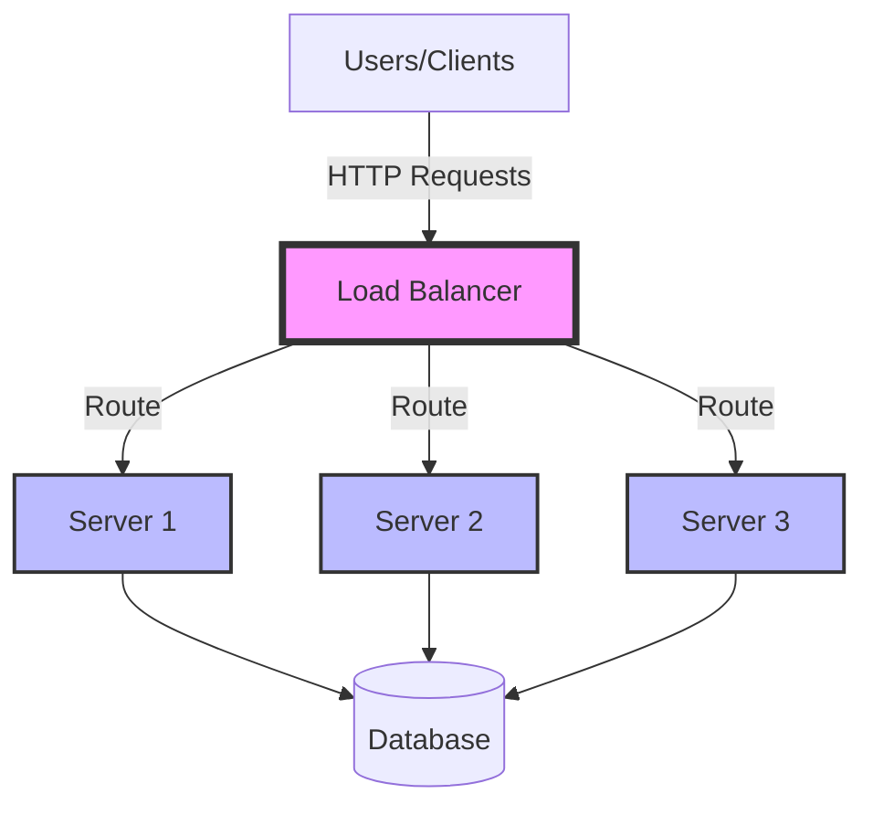

# Load Balancers: The Traffic Managers of the Internet

*Last Updated: December 2024*

---

## 🧒 **Explain Like I'm 5**

**Imagine a busy ice cream shop with one person serving customers. The line gets really long and slow!**

Now imagine the shop hires 3 workers. A "Load Balancer" is like a friendly person at the door who says:
- "You go to Worker #1"
- "You go to Worker #2"  
- "You go to Worker #3"

This way, everyone gets served faster because the work is shared! That's exactly what a Load Balancer does for websites - it sends visitors to different servers so no single server gets too busy.

---

## 📋 **What is Load Balancing?**

Load balancing distributes incoming network traffic across multiple servers to ensure no single server becomes overwhelmed. Think of it as a smart traffic controller that decides which server should handle each request.

### **Simple Analogy:**
```
Without Load Balancer:
All traffic → Server 1 (overloaded!) 😰
             Server 2 (sitting idle)
             Server 3 (sitting idle)

With Load Balancer:
Traffic → Load Balancer → Server 1 ✅
                       → Server 2 ✅
                       → Server 3 ✅
(Everyone happy! 😊)
```

---

## 🎯 **Why It Matters**

### **1. Scalability** 
- **Kid-friendly:** "Add more workers when shop gets busy"
- **Technical:** Horizontally scale by adding more servers without changing code

### **2. High Availability**
- **Kid-friendly:** "If one worker gets sick, others keep working"  
- **Technical:** Automatic failover - if one server fails (99% → 0%), others handle traffic seamlessly

### **3. Performance**
- **Kid-friendly:** "Shorter wait times when work is shared"
- **Technical:** Reduced latency by distributing load, preventing bottlenecks

### **4. Maintenance**
- **Kid-friendly:** "One worker can take a break while others work"
- **Technical:** Zero-downtime deployments - take servers offline for updates while others serve traffic

---

## 📊 **Visual Architecture**



---

## 🏗️ **Types of Load Balancers**

### **1. Hardware Load Balancers**

**Kid-friendly:** "Like a special expensive robot built just for this job"

**Technical:**
- Physical appliances (F5 BIG-IP, Citrix NetScaler)
- High performance but expensive ($20K-$100K+)
- Used by large enterprises with massive traffic
- Pros: Very fast, specialized hardware
- Cons: Expensive, less flexible, vendor lock-in

---

### **2. Software Load Balancers** ⭐ (Most Common)

**Kid-friendly:** "Like a smart computer program that can run anywhere"

**Technical:**
- Run on standard servers (Nginx, HAProxy, AWS ELB)
- Cost-effective and flexible
- Can run on cloud or on-premise
- Pros: Affordable, configurable, cloud-native
- Cons: Slightly slower than specialized hardware

**Popular Options:**
```
┌──────────────┬────────────┬──────────────┐
│   Nginx      │  HAProxy   │   AWS ELB    │
├──────────────┼────────────┼──────────────┤
│ Web server + │ Pure load  │ Managed by   │
│ load balancer│ balancer   │ AWS (no ops) │
│              │            │              │
│ Free/Open    │ Free/Open  │ Pay per use  │
└──────────────┴────────────┴──────────────┘
```

---

### **3. DNS Load Balancing**

**Kid-friendly:** "Like having multiple addresses for the same shop"

**Technical:**
- Distribute traffic at DNS resolution level
- Returns different IP addresses for same domain
- Pros: Simple, works at global level
- Cons: Doesn't detect server health, cached by clients

---

## ⚖️ **Load Balancing Algorithms**

### **1. Round Robin** (Simplest)

**Kid-friendly:** "Take turns! You, then you, then you, then back to you..."

**Technical:**
```
Request 1 → Server 1
Request 2 → Server 2  
Request 3 → Server 3
Request 4 → Server 1  (cycle repeats)
```

**Code Example:**
```python
class RoundRobinLoadBalancer:
    def __init__(self, servers):
        self.servers = servers
        self.current = 0
    
    def get_next_server(self):
        """Round-robin algorithm"""
        server = self.servers[self.current]
        self.current = (self.current + 1) % len(self.servers)
        return server

# Usage
lb = RoundRobinLoadBalancer(['server1.com', 'server2.com', 'server3.com'])
print(lb.get_next_server())  # server1.com
print(lb.get_next_server())  # server2.com
print(lb.get_next_server())  # server3.com
print(lb.get_next_server())  # server1.com (back to start)
```

**When to use:** Equal servers, similar request complexity  
**When NOT to use:** Servers have different capacities, requests vary in complexity

---

### **2. Least Connections** (Smarter)

**Kid-friendly:** "Send people to the worker who's helping the fewest customers right now"

**Technical:**
```
Server 1: 10 active connections
Server 2: 5 active connections  ← Route here!
Server 3: 8 active connections

Next request goes to Server 2 (least busy)
```

**Code Example:**
```python
class LeastConnectionsLoadBalancer:
    def __init__(self, servers):
        self.servers = {server: 0 for server in servers}
    
    def get_next_server(self):
        """Route to server with fewest connections"""
        return min(self.servers, key=self.servers.get)
    
    def increment_connection(self, server):
        self.servers[server] += 1
    
    def decrement_connection(self, server):
        self.servers[server] -= 1

# Usage
lb = LeastConnectionsLoadBalancer(['server1', 'server2', 'server3'])
server = lb.get_next_server()  # Returns server with least connections
lb.increment_connection(server)
# ... handle request ...
lb.decrement_connection(server)
```

**When to use:** Long-running connections (WebSockets, database queries)  
**When NOT to use:** Short-lived HTTP requests (overhead not worth it)

---

### **3. Weighted Round Robin**

**Kid-friendly:** "Some workers are faster, so they get more customers"

**Technical:**
```
Server 1: weight = 5 (powerful server)
Server 2: weight = 2 (medium server)
Server 3: weight = 1 (weak server)

Out of 8 requests:
Server 1 gets 5 requests
Server 2 gets 2 requests  
Server 3 gets 1 request
```

**When to use:** Servers have different capabilities (CPU, RAM)

---

### **4. IP Hash** (Sticky Sessions)

**Kid-friendly:** "Same customer always goes to same worker (they remember you!)"

**Technical:**
```python
def ip_hash_lb(client_ip, servers):
    """Hash client IP to consistent server"""
    hash_value = hash(client_ip)
    index = hash_value % len(servers)
    return servers[index]

# Same IP always goes to same server
print(ip_hash_lb("192.168.1.1", servers))  # Always Server 2
print(ip_hash_lb("192.168.1.1", servers))  # Always Server 2
print(ip_hash_lb("10.0.0.5", servers))     # Always Server 1
```

**When to use:** Session persistence required (shopping carts, user sessions)  
**Drawback:** Uneven distribution if IPs aren't well distributed

---

## 💻 **Complete Implementation**

```python
from collections import defaultdict
import time

class LoadBalancer:
    """Production-ready load balancer with health checks"""
    
    def __init__(self, servers, algorithm='round_robin'):
        self.servers = servers
        self.algorithm = algorithm
        self.current = 0
        self.connections = defaultdict(int)
        self.health_status = {server: True for server in servers}
    
    def get_next_server(self):
        """Get next available healthy server"""
        healthy_servers = [s for s in self.servers if self.health_status[s]]
        
        if not healthy_servers:
            raise Exception("No healthy servers available!")
        
        if self.algorithm == 'round_robin':
            return self._round_robin(healthy_servers)
        elif self.algorithm == 'least_connections':
            return self._least_connections(healthy_servers)
        else:
            return self._round_robin(healthy_servers)
    
    def _round_robin(self, servers):
        server = servers[self.current % len(servers)]
        self.current += 1
        return server
    
    def _least_connections(self, servers):
        return min(servers, key=lambda s: self.connections[s])
    
    def mark_unhealthy(self, server):
        """Mark server as unhealthy (failed health check)"""
        self.health_status[server] = False
        print(f"⚠️  Server {server} marked unhealthy")
    
    def mark_healthy(self, server):
        """Mark server as healthy again"""
        self.health_status[server] = True
        print(f"✅ Server {server} is healthy")
    
    def increment_connection(self, server):
        self.connections[server] += 1
    
    def decrement_connection(self, server):
        self.connections[server] = max(0, self.connections[server] - 1)

# Demo usage
if __name__ == "__main__":
    servers = ['server1.example.com', 'server2.example.com', 'server3.example.com']
    lb = LoadBalancer(servers, algorithm='round_robin')
    
    print("🚀 Load Balancer Demo\n")
    
    # Simulate 10 requests
    for i in range(10):
        try:
            server = lb.get_next_server()
            print(f"Request {i+1:2d} → {server}")
        except Exception as e:
            print(f"❌ Error: {e}")
    
    # Simulate server failure
    print("\n⚠️  Simulating server failure...")
    lb.mark_unhealthy('server2.example.com')
    
    print("\n🔄 Continuing with healthy servers:")
    for i in range(5):
        server = lb.get_next_server()
        print(f"Request {i+11:2d} → {server}")
```

---

## 🏢 **Real-World Examples**

### **Netflix**
- Uses AWS Elastic Load Balancing (ELB)
- Distributes **millions of requests per second**
- Multiple layers of load balancing (edge, origin, service)
- Auto-scales based on traffic patterns

### **Uber**
- Global load balancing across data centers
- Geo-based routing (route to nearest data center)
- Handles **millions of ride requests** daily
- Failover to backup regions if primary fails

### **Google Search**
- Custom load balancing infrastructure
- Routes to nearest data center
- Handles **5.6 billion searches per day**
- Sub-100ms response times globally

---

## 🔍 **Advanced Concepts**

### **Layer 4 vs Layer 7 Load Balancing**

**Kid-friendly:** "Layer 4 is like sorting mail by address. Layer 7 is like reading the letter and deciding what to do."

```
┌─────────────────────────────────────────────┐
│ Layer 7 (Application Layer)                 │
│ - Reads HTTP headers, URLs, cookies         │
│ - Can route /api → Backend, /static → CDN   │
│ - Slower but more intelligent               │
└─────────────────────────────────────────────┘
         ↕
┌─────────────────────────────────────────────┐
│ Layer 4 (Transport Layer)                   │
│ - Only sees IP address and port             │
│ - Fast but less flexible                    │
│ - Routes based on TCP/UDP                   │
└─────────────────────────────────────────────┘
```

**When to use Layer 7:**
- Content-based routing
- SSL termination
- URL-based routing
- Cookie-based session persistence

**When to use Layer 4:**
- Maximum performance needed
- Don't need to inspect content
- Non-HTTP traffic (databases, streaming)

---

### **Health Checks**

**Kid-friendly:** "Regularly check if workers are okay before sending them customers"

```python
import requests
import time

def health_check(server, endpoint="/health"):
    """Check if server is responding"""
    try:
        response = requests.get(f"http://{server}{endpoint}", timeout=2)
        return response.status_code == 200
    except:
        return False

def monitor_servers(lb, interval=5):
    """Continuously monitor server health"""
    while True:
        for server in lb.servers:
            if health_check(server):
                lb.mark_healthy(server)
            else:
                lb.mark_unhealthy(server)
        time.sleep(interval)
```

---

## 🤔 **Common Interview Questions**

### **Q1: What happens if a server fails during load balancing?**

**Simple Answer:** "Health checks detect failed servers and stop routing traffic to them"

**Technical Answer:**
- Load balancer performs periodic health checks (every 5-30 seconds)
- If server fails health check 3 consecutive times → marked unhealthy
- No new connections routed to unhealthy server
- Existing connections handled gracefully (depends on config)
- When server recovers → health check passes → back in rotation

---

### **Q2: How do you handle sticky sessions (session affinity)?**

**Simple Answer:** "Make sure the same user always goes to the same server"

**Technical Answer:**
Several methods:
1. **IP Hash**: Hash client IP → consistent server
2. **Cookie-based**: LB sets cookie → routes based on cookie value
3. **Consistent Hashing**: Minimize disruption when servers added/removed

```python
def consistent_hash(key, servers):
    """Consistent hashing for sticky sessions"""
    import hashlib
    hash_value = int(hashlib.md5(key.encode()).hexdigest(), 16)
    return servers[hash_value % len(servers)]
```

**Trade-off:** Less flexible load distribution for better user experience

---

### **Q3: Layer 4 vs Layer 7 load balancing?**

**Technical Answer:**

| Aspect | Layer 4 (Transport) | Layer 7 (Application) |
|--------|-------------------|---------------------|
| **Speed** | Faster (less processing) | Slower (must parse content) |
| **Routing** | IP + Port only | URL, headers, cookies |
| **Use Case** | High-performance, any protocol | HTTP/HTTPS with smart routing |
| **SSL** | Pass-through | Can terminate SSL |
| **Example** | TCP load balancer | Nginx, AWS ALB |

---

### **Q4: How would you design load balancing for 1 million requests/second?**

**Answer:**
1. **Multiple layers**: Edge → Regional → Service level
2. **Auto-scaling**: Scale LB instances based on traffic
3. **Geo-distribution**: Route to nearest data center
4. **Caching**: CDN for static content (reduces backend load)
5. **Connection pooling**: Reuse connections to backend
6. **Health monitoring**: Fast detection of failures

---

## 📊 **Performance Metrics**

```
Key Metrics to Monitor:
┌─────────────────────┬────────────────┐
│ Request Rate        │ req/sec        │
│ Error Rate          │ % failures     │
│ Response Time (p50) │ ms (median)    │
│ Response Time (p99) │ ms (99th %)    │
│ Active Connections  │ count          │
│ Server Health       │ up/down        │
└─────────────────────┴────────────────┘
```

---

## 📚 **Further Reading & Resources**

**Documentation:**
- [AWS Elastic Load Balancing](https://aws.amazon.com/elasticloadbalancing/)
- [Nginx Load Balancing Guide](https://nginx.org/en/docs/http/load_balancing.html)
- [HAProxy Documentation](http://www.haproxy.org/)

**Tools to Try:**
- **Local testing**: Nginx (free, easy to set up)
- **Cloud**: AWS ELB, Google Cloud Load Balancing
- **Learning**: Set up 3 local servers, configure Nginx as LB

**Next Steps:**
- Try implementing round-robin yourself
- Set up Nginx as load balancer locally
- Read about consistent hashing
- Study Netflix's Zuul (API Gateway + LB)

---

## 🎯 **Key Takeaways**

✅ Load balancers distribute traffic across multiple servers  
✅ Improves scalability, availability, and performance  
✅ Multiple algorithms: Round Robin, Least Connections, Weighted, IP Hash  
✅ Health checks ensure traffic only goes to healthy servers  
✅ Layer 4 = fast, Layer 7 = smart  
✅ Used by every major tech company at scale  

---

**Next Topic:** [Caching Strategies](../caching.md)  
**Previous:** [System Design Introduction](../../README.md)

---

*Questions or feedback? Open an issue or contribute to improve this guide!*
