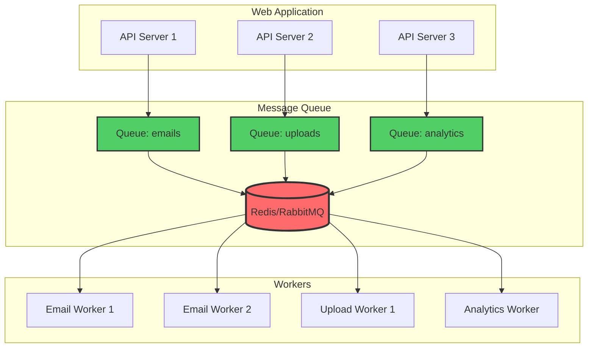

# Message Queues: Asynchronous Processing at Scale

*Last Updated: December 2024*

---

## 🧒 **Explain Like I'm 5**

**Imagine a busy restaurant kitchen!**

**Without a message queue:**
- Customer orders food 🍕
- Chef must stop and cook it RIGHT NOW
- Other customers wait... and wait... 😰
- Chef gets overwhelmed!

**With a message queue:**
- Customer orders food 🍕
- Order goes on a ticket board 📋 (the queue!)
- Customer gets: "We're cooking it!" ✅
- Chef cooks orders one-by-one from the board
- Everyone's happy! 😊

**A message queue is like that ticket board** - it holds tasks so they can be done later, in order, without overwhelming the system!

---

## 📋 **What is a Message Queue?**

A message queue is a form of asynchronous service-to-service communication that temporarily stores messages between a sender and a receiver. It enables systems to communicate without requiring both to be available simultaneously.

### **Simple Flow:**

```
Producer → [Message Queue] → Consumer
(Sender)      (Storage)      (Worker)

Example:
User uploads video → [Queue] → Video processor
User sends email   → [Queue] → Email sender
User makes payment → [Queue] → Payment processor
```

---

## 🎯 **Why Message Queues Matter**

### **Without Message Queue:**

```
User Request → API → Process Immediately
                     ↓
                  Wait... 15 seconds ⏳
                     ↓
                  Response

Problems:
❌ User waits for slow operations
❌ If server crashes, task is lost
❌ Can't handle traffic spikes
❌ One slow task blocks everything
```

### **With Message Queue:**

```
User Request → API → Add to Queue → Response (0.1 sec) ✅
                          ↓
                    [Background Worker]
                          ↓
                    Process when ready

Benefits:
✅ Instant response to user
✅ Tasks persist if server crashes
✅ Scale workers independently
✅ Smooth out traffic spikes
```

---

## 🏗️ **Core Concepts**

### **1. Producer**

**Kid-friendly:** "The person who writes the note"

**Technical:** Service that creates and sends messages to the queue.

```javascript
// Producer example
async function handleUserRegistration(userData) {
  // Save user to database (fast)
  const user = await db.createUser(userData);
  
  // Send welcome email (slow) - queue it!
  await messageQueue.send('email-queue', {
    type: 'welcome_email',
    userId: user.id,
    email: user.email
  });
  
  // Return immediately
  return { success: true, userId: user.id };
}
```

---

### **2. Message Queue (Broker)**

**Kid-friendly:** "The notepad that holds all the notes"

**Technical:** Storage system that holds messages until they're processed.

**Popular Options:**
- **RabbitMQ** - General purpose, AMQP protocol
- **Redis (Bull/BullMQ)** - Simple, fast, JavaScript-friendly
- **Amazon SQS** - Managed AWS service
- **Apache Kafka** - High throughput, stream processing

---

### **3. Consumer (Worker)**

**Kid-friendly:** "The person who reads and does the task"

**Technical:** Service that pulls messages from queue and processes them.

```javascript
// Consumer example
queue.process('email-queue', async (job) => {
  const { userId, email, type } = job.data;
  
  console.log(`Processing ${type} for ${email}`);
  
  try {
    await sendEmail(email, getEmailTemplate(type));
    return { success: true };
  } catch (error) {
    console.error('Email failed:', error);
    throw error; // Job will retry
  }
});
```

---

## 📊 **Message Queue Patterns**

### **1. Point-to-Point (Work Queue)**

**Kid-friendly:** "One note, one person does it"

```
Producer → [Queue] → Consumer 1 (picks up message)
                  → Consumer 2 (waiting)
                  → Consumer 3 (waiting)

Each message processed by ONE consumer
```

**Use Case:** Background tasks, job processing

```javascript
// Add job to queue
await queue.add('resize-image', {
  imageUrl: 'https://...',
  sizes: ['thumbnail', 'medium', 'large']
});

// Multiple workers compete for jobs
// Only ONE worker gets each job
```

---

### **2. Publish-Subscribe (Pub/Sub)**

**Kid-friendly:** "Announcement on loudspeaker - everyone hears it"

```
Publisher → [Topic] → Subscriber 1 (receives copy)
                   → Subscriber 2 (receives copy)
                   → Subscriber 3 (receives copy)

Each message goes to ALL subscribers
```

**Use Case:** Event broadcasting, notifications

```javascript
// Publish event
await pubsub.publish('user-registered', {
  userId: 123,
  username: 'alice',
  email: 'alice@example.com'
});

// Multiple services subscribe
// ALL of them receive the message

// Service 1: Email service
pubsub.subscribe('user-registered', sendWelcomeEmail);

// Service 2: Analytics service
pubsub.subscribe('user-registered', trackUserRegistration);

// Service 3: CRM service
pubsub.subscribe('user-registered', createCRMRecord);
```

---

### **3. Request-Reply**

**Kid-friendly:** "Send a question, wait for an answer"

```
Client → [Request Queue] → Server
       ← [Reply Queue]   ←

Client waits for server's response
```

**Use Case:** RPC (Remote Procedure Call), microservices communication

---

## 💻 **Real-World Implementation**

### **Using Bull (Redis-based queue)**

**Setup:**

```javascript
const Queue = require('bull');
const Redis = require('redis');

// Create queue
const emailQueue = new Queue('emails', {
  redis: {
    host: 'localhost',
    port: 6379
  }
});

// Configure retry and timeouts
const jobOptions = {
  attempts: 3,              // Retry up to 3 times
  backoff: {
    type: 'exponential',    // Wait longer between retries
    delay: 2000             // Start with 2 seconds
  },
  timeout: 30000,           // 30 second timeout
  removeOnComplete: 100,    // Keep last 100 completed jobs
  removeOnFail: 200         // Keep last 200 failed jobs
};
```

**Producer:**

```javascript
// API endpoint
app.post('/api/send-email', async (req, res) => {
  const { to, subject, body } = req.body;
  
  // Add to queue (returns immediately)
  const job = await emailQueue.add(
    {
      to,
      subject,
      body,
      timestamp: Date.now()
    },
    jobOptions
  );
  
  // Return job ID to client
  res.json({
    success: true,
    jobId: job.id,
    message: 'Email queued for sending'
  });
});

// Check job status endpoint
app.get('/api/job/:id', async (req, res) => {
  const job = await emailQueue.getJob(req.params.id);
  
  if (!job) {
    return res.status(404).json({ error: 'Job not found' });
  }
  
  const state = await job.getState();
  
  res.json({
    id: job.id,
    state: state,           // 'completed', 'failed', 'active', 'waiting'
    progress: job.progress,
    result: job.returnvalue
  });
});
```

**Consumer:**

```javascript
// Worker process (can run separately)
emailQueue.process(async (job) => {
  const { to, subject, body } = job.data;
  
  console.log(`Processing email to ${to}`);
  
  // Update progress
  job.progress(10);
  
  try {
    // Simulate email sending
    await sendEmailViaProvider(to, subject, body);
    
    job.progress(100);
    
    return {
      success: true,
      sentAt: new Date(),
      messageId: 'msg-123'
    };
    
  } catch (error) {
    console.error('Email failed:', error);
    
    // Throw error to trigger retry
    throw new Error(`Failed to send email: ${error.message}`);
  }
});

// Event handlers
emailQueue.on('completed', (job, result) => {
  console.log(`Job ${job.id} completed:`, result);
});

emailQueue.on('failed', (job, err) => {
  console.log(`Job ${job.id} failed:`, err.message);
  
  // Alert on final failure
  if (job.attemptsMade >= job.opts.attempts) {
    notifyAdminOfFailedJob(job);
  }
});

emailQueue.on('stalled', (job) => {
  console.log(`Job ${job.id} stalled (worker died?)`);
});
```

---

## 🎨 **Advanced Patterns**

### **Priority Queues**

**Kid-friendly:** "Important tasks jump to the front of the line"

```javascript
// Add job with priority
await queue.add(
  { type: 'welcome_email', userId: 123 },
  { priority: 5 }  // Lower number = higher priority (1 is highest)
);

await queue.add(
  { type: 'marketing_email', userId: 456 },
  { priority: 10 }  // Lower priority
);

// Welcome email processed first!
```

---

### **Delayed Jobs**

**Kid-friendly:** "Do this task... but in 1 hour"

```javascript
// Send reminder in 24 hours
await queue.add(
  { type: 'reminder', userId: 123 },
  { delay: 24 * 60 * 60 * 1000 }  // 24 hours in ms
);

// Use case: Trial expiration reminders, scheduled reports
```

---

### **Recurring Jobs (Cron)**

**Kid-friendly:** "Do this task every day at 9 AM"

```javascript
// Daily report at 9 AM
await queue.add(
  { type: 'daily_report' },
  {
    repeat: {
      cron: '0 9 * * *'  // Cron expression
    }
  }
);

// Use case: Daily backups, weekly reports, cleanup tasks
```

---

### **Rate Limiting**

**Kid-friendly:** "Don't do too many tasks at once"

```javascript
// Process max 100 jobs per minute
emailQueue.process({
  concurrency: 5,         // Max 5 jobs simultaneously
  limiter: {
    max: 100,             // Max 100 jobs
    duration: 60000       // Per 60 seconds
  }
}, async (job) => {
  // Process job
});

// Use case: Respect API rate limits, avoid overwhelming services
```

---

## 🔄 **Message Queue Architecture**



---

## 🛡️ **Reliability Patterns**

### **1. At-Least-Once Delivery**

**Kid-friendly:** "Make sure the task gets done, even if we try twice by mistake"

```javascript
// Problem: Worker crashes after processing, before acknowledging
// Solution: Job retried (might process twice)

queue.process(async (job) => {
  // Make operations idempotent (safe to repeat)
  
  // ❌ Bad: Increments twice if job retries
  await db.query('UPDATE balance SET amount = amount + 100');
  
  // ✅ Good: Check if already processed
  const processed = await db.query(
    'SELECT * FROM processed_jobs WHERE job_id = $1',
    [job.id]
  );
  
  if (processed.rows.length > 0) {
    console.log('Job already processed, skipping');
    return;
  }
  
  // Process job
  await doWork(job.data);
  
  // Mark as processed
  await db.query(
    'INSERT INTO processed_jobs (job_id) VALUES ($1)',
    [job.id]
  );
});
```

---

### **2. Dead Letter Queue (DLQ)**

**Kid-friendly:** "If a task fails too many times, put it in a special 'problem' box"

```javascript
const mainQueue = new Queue('emails');
const deadLetterQueue = new Queue('emails-dlq');

mainQueue.on('failed', async (job, err) => {
  // After all retries exhausted
  if (job.attemptsMade >= job.opts.attempts) {
    console.log(`Moving job ${job.id} to DLQ`);
    
    await deadLetterQueue.add({
      originalJob: job.data,
      error: err.message,
      failedAt: new Date(),
      attempts: job.attemptsMade
    });
  }
});

// Manually review DLQ later
// Fix issues and requeue or discard
```

---

### **3. Circuit Breaker**

**Kid-friendly:** "If a service keeps failing, stop trying for a while"

```javascript
class CircuitBreaker {
  constructor(threshold = 5, timeout = 60000) {
    this.failureCount = 0;
    this.threshold = threshold;
    this.timeout = timeout;
    this.state = 'CLOSED';  // CLOSED, OPEN, HALF_OPEN
    this.nextAttempt = Date.now();
  }
  
  async call(fn) {
    if (this.state === 'OPEN') {
      if (Date.now() < this.nextAttempt) {
        throw new Error('Circuit breaker is OPEN');
      }
      this.state = 'HALF_OPEN';
    }
    
    try {
      const result = await fn();
      this.onSuccess();
      return result;
    } catch (error) {
      this.onFailure();
      throw error;
    }
  }
  
  onSuccess() {
    this.failureCount = 0;
    this.state = 'CLOSED';
  }
  
  onFailure() {
    this.failureCount++;
    if (this.failureCount >= this.threshold) {
      this.state = 'OPEN';
      this.nextAttempt = Date.now() + this.timeout;
      console.log('Circuit breaker OPENED');
    }
  }
}

// Usage
const breaker = new CircuitBreaker();

queue.process(async (job) => {
  await breaker.call(async () => {
    return await externalAPI.call(job.data);
  });
});
```

---

## 🚀 **Real-World Use Cases**

### **1. E-commerce Order Processing**

```
Order placed → [Queue] → Multiple workers:
                         ├─ Payment processor
                         ├─ Inventory updater
                         ├─ Email sender (confirmation)
                         ├─ Shipping label generator
                         └─ Analytics tracker
```

```javascript
// Order placed
await orderQueue.add({
  orderId: 12345,
  userId: 789,
  items: [...],
  total: 99.99
});

// Worker 1: Process payment
paymentQueue.process(async (job) => {
  await stripe.charge(job.data.total);
  await pubsub.publish('payment-completed', job.data);
});

// Worker 2: Update inventory
inventoryQueue.process(async (job) => {
  for (const item of job.data.items) {
    await db.decrementStock(item.id, item.quantity);
  }
});

// All happen asynchronously!
```

---

### **2. Video Processing Pipeline**

```
Upload video → [Queue 1] → Transcode worker
                              ↓
                         [Queue 2] → Thumbnail generator
                              ↓
                         [Queue 3] → CDN uploader
                              ↓
                         [Queue 4] → User notification
```

```javascript
// Stage 1: Transcode
uploadQueue.process(async (job) => {
  const { videoUrl, userId } = job.data;
  
  const transcodedUrl = await transcodeVideo(videoUrl, {
    formats: ['1080p', '720p', '480p']
  });
  
  // Next stage
  await thumbnailQueue.add({
    videoUrl: transcodedUrl,
    userId
  });
  
  return { transcodedUrl };
});

// Stage 2: Generate thumbnail
thumbnailQueue.process(async (job) => {
  const thumbnail = await generateThumbnail(job.data.videoUrl);
  
  // Next stage
  await cdnQueue.add({
    videoUrl: job.data.videoUrl,
    thumbnail,
    userId: job.data.userId
  });
});

// Pipeline continues...
```

---

### **3. Notification System**

```javascript
// Single event → Multiple notification types
await notificationQueue.add({
  type: 'new_follower',
  userId: 123,
  followerId: 456
});

// Worker handles all notification types
notificationQueue.process(async (job) => {
  const { type, userId, followerId } = job.data;
  
  const preferences = await getUserPreferences(userId);
  
  // Send based on user preferences
  if (preferences.email) {
    await sendEmail(userId, type, { followerId });
  }
  
  if (preferences.push) {
    await sendPushNotification(userId, type, { followerId });
  }
  
  if (preferences.sms) {
    await sendSMS(userId, type, { followerId });
  }
  
  // In-app notification (always)
  await createInAppNotification(userId, type, { followerId });
});
```

---

## 📊 **Monitoring & Observability**

```javascript
// Queue metrics
const metrics = {
  waiting: await queue.getWaitingCount(),
  active: await queue.getActiveCount(),
  completed: await queue.getCompletedCount(),
  failed: await queue.getFailedCount(),
  delayed: await queue.getDelayedCount(),
  
  // Performance
  avgProcessingTime: 2500,  // ms
  throughput: 100,          // jobs/minute
  
  // Health
  oldestJob: await queue.getOldestWaiting(),
  stallCount: 3
};

// Alert if queue backing up
if (metrics.waiting > 10000) {
  alert('Queue backing up! Add more workers');
}

if (metrics.failed > 100) {
  alert('High failure rate!');
}
```

---

## 🤔 **Common Interview Questions**

### **Q1: Why use a message queue instead of direct API calls?**

**Answer:**
```
Benefits:
✅ Asynchronous - don't block user
✅ Resilience - tasks survive crashes
✅ Scalability - scale workers independently
✅ Decoupling - services don't need to know about each other
✅ Load smoothing - handle traffic spikes

Example: User uploads video
- Without queue: User waits 5 minutes for processing
- With queue: User gets instant "Processing..." response
```

### **Q2: What happens if a worker crashes while processing a job?**

**Answer:**
```
1. Job remains in "active" state initially
2. After timeout (e.g., 30 sec), marked as "stalled"
3. Queue automatically retries the job
4. New worker picks it up

Important: Make operations idempotent!
- Job might process twice
- Use unique IDs or check if already processed
```

### **Q3: How do you handle job ordering?**

**Answer:**
```
Options:
1. FIFO - First in, first out (default)
2. Priority - High priority jobs first
3. Group/Session - Process all jobs for user together
4. Delay - Process at specific time

Redis/Bull maintains order within each category
```

### **Q4: Difference between message queue and pub/sub?**

**Answer:**
```
Message Queue (Point-to-Point):
- Each message processed by ONE consumer
- Work distribution
- Example: Background jobs

Pub/Sub (Broadcast):
- Each message to ALL subscribers
- Event notification
- Example: User registered event

Some systems support both (Redis, RabbitMQ)
```

---

## 🎯 **Best Practices**

```
✅ Make jobs idempotent (safe to retry)
✅ Set appropriate timeouts
✅ Use dead letter queues
✅ Monitor queue depth
✅ Scale workers based on load
✅ Log job failures with context
✅ Set retry limits (don't retry forever)
✅ Use priority for important jobs
❌ Don't pass large data in messages (use references)
❌ Don't make jobs dependent on each other
❌ Don't forget to handle failures
```

---

## 🚀 **Next Steps**

1. **Practice:** Set up Redis + Bull locally, create a simple queue
2. **Try:** Build a job that sends emails asynchronously
3. **Read Next:** [API Design Best Practices](./api-design.md)
4. **Build:** Add background processing to your project

---

## 📚 **Further Reading**

- [Bull Documentation](https://github.com/OptimalBits/bull)
- [RabbitMQ Tutorials](https://www.rabbitmq.com/getstarted.html)
- [AWS SQS Guide](https://docs.aws.amazon.com/sqs/)
- [Kafka Documentation](https://kafka.apache.org/documentation/)

---

**Next Topic:** [API Design Principles](./api-design.md)  
**Previous:** [Databases](./databases.md)

---

*Questions or improvements? Open an issue or submit a PR!*
