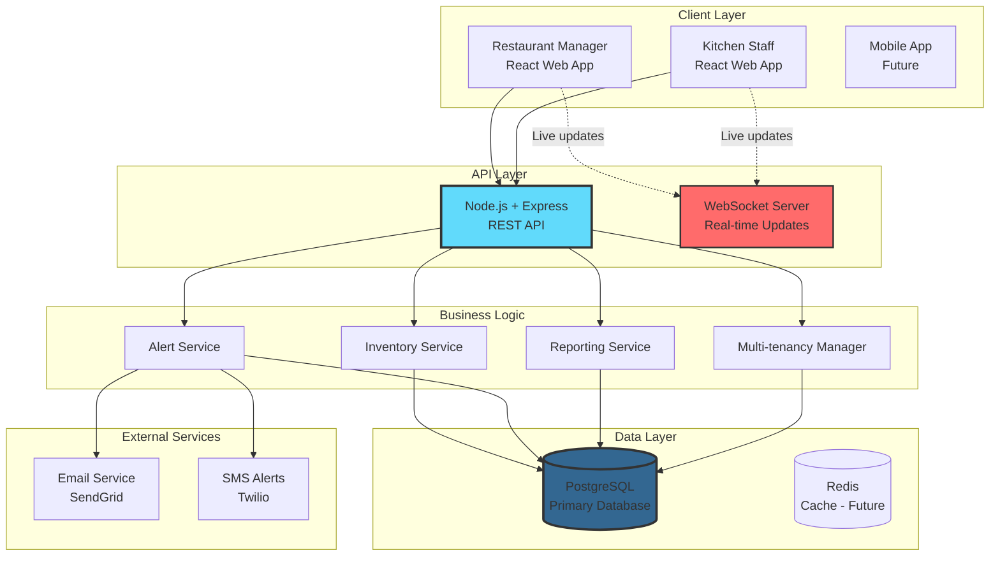

# Case Study: Plateo - Restaurant Inventory Management

*A real-world system design case study from a project I'm building as technical co-founder*

**Status:** Active Development | **Last Updated:** December 2024  
**Tech Stack:** React, Node.js, PostgreSQL

---

## 🧒 **Explain Like I'm 5**

**Imagine you run a lemonade stand!**

You need to keep track of:
- How many lemons you have
- How much sugar is left
- When to order more cups

**Plateo is like a smart notebook that:**
- 📝 Automatically counts your supplies
- ⚠️ Tells you when you're running low
- 📊 Shows you what you use most
- 🏪 Works for restaurants with LOTS of ingredients!

Instead of checking every shelf by hand (boring!), restaurant owners just look at their phone and know exactly what they have. Cool, right?

---

## 📋 **Overview**

Plateo is a cloud-based SaaS platform that helps restaurants track inventory, reduce food waste, and optimize purchasing decisions in real-time.

### **The Problem in Numbers:**
```
┌─────────────────────────────────────────┐
│ 🍕 4-10% of restaurant revenue          │
│    lost to food waste                   │
│                                         │
│ ⏰ 5-10 hours/week                      │
│    spent on manual inventory tracking  │
│                                         │
│ 📉 30% of inventory issues              │
│    cause stockouts during peak hours   │
└─────────────────────────────────────────┘
```

---

## 🎯 **The Problem (Detailed)**

### **Pain Point 1: Food Waste**
- **Kid-friendly:** "Throwing away spoiled food = throwing away money"
- **Business impact:** A $1M/year restaurant loses $40K-$100K to waste
- **Root cause:** Over-ordering due to poor tracking

### **Pain Point 2: Manual Tracking**
- **Kid-friendly:** "Counting everything by hand takes forever"
- **Business impact:** Staff spending hours with clipboards instead of serving customers
- **Root cause:** No automated system, spreadsheets get outdated quickly

### **Pain Point 3: Multi-Location Chaos**
- **Kid-friendly:** "When you have 5 lemonade stands, how do you know what each one needs?"
- **Business impact:** Restaurant chains can't see inventory across all locations
- **Root cause:** Each location using different systems or none at all

### **Pain Point 4: Stockouts**
- **Kid-friendly:** "Running out of ingredients when customers want them"
- **Business impact:** Lost sales, unhappy customers, poor reviews
- **Root cause:** No alerts when inventory runs low

---

## 🏗️ **System Architecture**

### **High-Level View**



**Simple Explanation:**
```
👤 Users (restaurants) 
    ↓
🌐 Website (React - what you see)
    ↓
🔧 API Server (Node.js - the brain)
    ↓
💾 Database (PostgreSQL - where data lives)
    ↓
📧 Alerts (Email/SMS when low on stock)
```

---

## 💡 **Key Design Decisions**

### **Decision 1: PostgreSQL over NoSQL**

**Kid-friendly:** "We chose a organized filing cabinet (SQL) instead of a pile of papers (NoSQL)"

#### **Why PostgreSQL?**

```
┌─────────────────────────────────────────────┐
│ Reason #1: ACID Compliance                  │
│ ────────────────────────────                │
│ Inventory counts MUST be accurate.          │
│ Can't have "maybe you have 10 eggs" -       │
│ it's either 10 or not!                      │
└─────────────────────────────────────────────┘

┌─────────────────────────────────────────────┐
│ Reason #2: Complex Relationships            │
│ ────────────────────────────                │
│ Items → Suppliers → Orders → Locations      │
│ → Recipes → Ingredients                     │
│ SQL excels at relationships!                │
└─────────────────────────────────────────────┘

┌─────────────────────────────────────────────┐
│ Reason #3: Strong Consistency               │
│ ────────────────────────────                │
│ Two chefs can't both use "last egg"         │
│ Database ensures consistency                │
└─────────────────────────────────────────────┘

┌─────────────────────────────────────────────┐
│ Reason #4: Analytics & Reporting            │
│ ────────────────────────────                │
│ "Show me usage trends"                      │
│ "Which items are most wasted?"              │
│ SQL makes this easy!                        │
└─────────────────────────────────────────────┘
```

#### **Trade-off Made:**

**What we gave up:** Horizontal scalability (harder to split across many servers)  
**What we gained:** Data consistency, integrity, powerful querying  
**Why it's worth it:** For inventory, being correct > being fast

#### **Database Schema (Simplified)**

```sql
-- Core tables
CREATE TABLE restaurants (
    id UUID PRIMARY KEY,
    name VARCHAR(255),
    tenant_id UUID,  -- For multi-tenancy
    created_at TIMESTAMP
);

CREATE TABLE inventory_items (
    id UUID PRIMARY KEY,
    restaurant_id UUID REFERENCES restaurants(id),
    name VARCHAR(255),
    quantity DECIMAL(10,2),
    unit VARCHAR(50),  -- kg, liters, pieces, etc.
    low_stock_threshold DECIMAL(10,2),
    version INTEGER DEFAULT 0,  -- For optimistic locking!
    updated_at TIMESTAMP
);

CREATE TABLE stock_movements (
    id UUID PRIMARY KEY,
    item_id UUID REFERENCES inventory_items(id),
    quantity_change DECIMAL(10,2),
    movement_type VARCHAR(50),  -- 'usage', 'purchase', 'waste', 'transfer'
    timestamp TIMESTAMP,
    user_id UUID
);
```

---

### **Decision 2: Real-Time Inventory Updates**

**Kid-friendly:** "When one person uses an egg, everyone's screen updates instantly - like magic! ✨"

#### **The Challenge:**

```
Scenario: Busy kitchen during dinner rush

Chef A looks at screen: "10 eggs left"
Chef B looks at screen: "10 eggs left"

Chef A uses 5 eggs → Updates: "5 eggs left"
Chef B uses 5 eggs → Updates: "5 eggs left"  

❌ Problem: We actually have 0 eggs, not 5!
```

#### **Solution: Optimistic Locking + WebSockets**

**Part 1: Optimistic Locking (Database Level)**

```sql
-- Every update includes version check
UPDATE inventory_items 
SET 
    quantity = quantity - 5,  -- Reduce by 5
    version = version + 1,     -- Increment version
    updated_at = NOW()
WHERE 
    item_id = '123-abc'
    AND version = 7;  -- ⚠️ Only update if version still 7!

-- If another update happened first, this fails
-- Application must retry with new version
```

**How it works:**
1. Chef A reads: eggs=10, version=7
2. Chef B reads: eggs=10, version=7
3. Chef A updates: eggs=5, version=8 ✅ (succeeds first)
4. Chef B tries to update with version=7 ❌ (fails! version is now 8)
5. System tells Chef B: "Someone else updated, refresh and try again"

**Part 2: WebSocket Real-time Updates**

```javascript
// Backend: When inventory changes, broadcast to all connected clients
io.to(restaurantId).emit('inventory:updated', {
    itemId: '123-abc',
    newQuantity: 5,
    version: 8,
    updatedBy: 'Chef Alice'
});

// Frontend: Automatically update screen
socket.on('inventory:updated', (data) => {
    updateInventoryDisplay(data);
    showNotification(`${data.updatedBy} updated ${data.itemName}`);
});
```

**Result:**
```
Chef A uses 5 eggs
    → Database updates: 5 eggs, version 8
    → WebSocket broadcasts update
    → Chef B's screen updates INSTANTLY: "5 eggs left"
    → Everyone sees accurate count! ✅
```

---

### **Decision 3: Multi-Location Support**

**Kid-friendly:** "Like having one big book that tracks all your lemonade stands at once!"

#### **Architecture: Multi-Tenancy**

```
┌────────────────────────────────────────────┐
│ Chain: "Burger King Toronto"               │
│ (tenant_id: bk-toronto-001)                │
├────────────────────────────────────────────┤
│  Location 1: Downtown                      │
│    - Inventory: 500 items                  │
│    - Staff: 20 users                       │
│                                            │
│  Location 2: Midtown                       │
│    - Inventory: 450 items                  │
│    - Staff: 15 users                       │
│                                            │
│  Location 3: Airport                       │
│    - Inventory: 600 items                  │
│    - Staff: 25 users                       │
└────────────────────────────────────────────┘

┌────────────────────────────────────────────┐
│ Chain: "Sushi Place" (different tenant)   │
│ (tenant_id: sushi-place-001)              │
│ - Completely isolated data                 │
│ - Different users, items, locations        │
└────────────────────────────────────────────┘
```

#### **Implementation:**

```javascript
// Every query includes tenant_id
async function getInventory(restaurantId, userId) {
    // 1. Get user's tenant
    const user = await db.query(
        'SELECT tenant_id FROM users WHERE id = $1',
        [userId]
    );
    
    // 2. Only fetch data for THIS tenant
    const inventory = await db.query(`
        SELECT * FROM inventory_items
        WHERE restaurant_id = $1
        AND tenant_id = $2  -- ⚠️ Security: can only see own tenant!
    `, [restaurantId, user.tenant_id]);
    
    return inventory;
}
```

**Security Benefit:** Even if someone guesses a restaurant_id, they can't access it unless they're in the same tenant.

---

## 📊 **Scalability Considerations**

### **Current Scale (MVP)**

```
Target: 100-500 restaurants
├── ~1,000 items per restaurant
├── ~100 updates per restaurant per day
├── ~50 concurrent users per restaurant
└── Total: 10,000-50,000 daily updates

Infrastructure Cost: ~$200-300/month
Response Time: <200ms (95th percentile)
```

### **Future Scale (If Successful)**

```
Target: 10,000+ restaurants
├── ~1,000 items per restaurant  
├── ~100 updates per restaurant per day
└── Total: 1,000,000 daily updates

Needed Improvements:
┌────────────────────────────────────────┐
│ 1. Database Read Replicas              │
│    - Master for writes                 │
│    - 3-5 replicas for reads            │
│    - Reduces load on primary DB        │
└────────────────────────────────────────┘

┌────────────────────────────────────────┐
│ 2. Redis Caching Layer                │
│    - Cache frequently accessed items   │
│    - Reduce DB queries by 70%+         │
│    - TTL: 5 minutes for inventory      │
└────────────────────────────────────────┘

┌────────────────────────────────────────┐
│ 3. CDN for Static Assets              │
│    - CloudFront or Cloudflare          │
│    - Faster page loads globally        │
└────────────────────────────────────────┘

┌────────────────────────────────────────┐
│ 4. Horizontal API Scaling              │
│    - 5-10 Node.js instances            │
│    - Load balancer in front            │
│    - Auto-scale based on traffic       │
└────────────────────────────────────────┘

Estimated Cost: ~$2,000-5,000/month
Expected Response Time: <100ms
```

---

## 🚧 **Challenges & Solutions**

### **Challenge 1: Concurrent Inventory Updates**

**Problem:** Two kitchen staff updating same item simultaneously

**Kid-friendly:** "Two kids trying to take the last cookie at same time!"

**Solution:**
```javascript
// Optimistic locking with retry logic
async function updateInventory(itemId, quantityChange, maxRetries = 3) {
    for (let attempt = 0; attempt < maxRetries; attempt++) {
        try {
            // Get current version
            const item = await getItem(itemId);
            
            // Try to update with version check
            const result = await db.query(`
                UPDATE inventory_items
                SET quantity = quantity + $1,
                    version = version + 1
                WHERE id = $2 AND version = $3
                RETURNING *
            `, [quantityChange, itemId, item.version]);
            
            if (result.rowCount === 0) {
                // Version mismatch - someone else updated
                if (attempt < maxRetries - 1) {
                    await sleep(100 * Math.pow(2, attempt)); // Exponential backoff
                    continue; // Retry
                }
                throw new Error('Update conflict after retries');
            }
            
            // Success!
            return result.rows[0];
        } catch (error) {
            if (attempt === maxRetries - 1) throw error;
        }
    }
}
```

---

### **Challenge 2: Accurate Low-Stock Alerts**

**Problem:** Don't want alerts for temporary usage spikes

**Kid-friendly:** "Don't panic if someone uses lots of flour - they might be baking a big batch!"

**Solution: Smart Threshold with Time Windows**

```javascript
async function checkLowStockAlert(itemId) {
    const item = await getItem(itemId);
    
    // Get usage pattern for last 7 days
    const avgDailyUsage = await getAverageDailyUsage(itemId, days=7);
    
    // Calculate "days of supply remaining"
    const daysRemaining = item.quantity / avgDailyUsage;
    
    // Alert only if consistently low for 1 hour
    if (daysRemaining < 2) {
        // Check if below threshold for last hour
        const recentLevels = await getRecentLevels(itemId, minutes=60);
        const consistentlyLow = recentLevels.every(level => 
            level / avgDailyUsage < 2
        );
        
        if (consistentlyLow) {
            sendAlert({
                message: `Low stock: ${item.name} (${daysRemaining.toFixed(1)} days left)`,
                priority: daysRemaining < 1 ? 'HIGH' : 'MEDIUM'
            });
        }
    }
}
```

---

### **Challenge 3: Multi-Currency Support**

**Problem:** International chains use different currencies

**Kid-friendly:** "Some lemonade stands use dollars, some use euros!"

**Solution: Store as Smallest Unit**

```javascript
// Store amounts as integers (cents/pence)
const priceSchema = {
    amount: 1599,      // $15.99 stored as 1599 cents
    currency: 'USD'
};

// Convert for display
function formatPrice(amount, currency) {
    const divisor = getCurrencyDivisor(currency); // 100 for most, 1 for JPY
    return new Intl.NumberFormat('en-US', {
        style: 'currency',
        currency: currency
    }).format(amount / divisor);
}

// Benefits:
// ✅ No floating point errors
// ✅ Easy math: 1599 + 399 = 1998
// ✅ Currency conversion: just store exchange rate
```

---

## 💰 **Cost Analysis**

### **MVP Phase (Current)**

```
┌────────────────────────┬──────────┐
│ PostgreSQL (managed)   │ $50-100  │
│ Node.js hosting (AWS)  │ $25-50   │
│ Redis (future)         │ $0       │
│ SendGrid (email)       │ $15      │
│ Twilio (SMS)           │ $20      │
│ Domain + SSL           │ $10      │
├────────────────────────┼──────────┤
│ TOTAL/MONTH            │ ~$120-195│
└────────────────────────┴──────────┘

Revenue Model:
- $99/month per restaurant
- 3 restaurants = break-even
- Target: 50 restaurants in Year 1 = $4,950/month
```

### **Scale Phase (Future)**

```
┌────────────────────────┬──────────┐
│ Database (replicas)    │ $500     │
│ API servers (5x)       │ $250     │
│ Redis cluster          │ $100     │
│ CDN                    │ $50      │
│ Monitoring             │ $50      │
│ Email/SMS              │ $200     │
├────────────────────────┼──────────┤
│ TOTAL/MONTH            │ ~$1,150  │
└────────────────────────┴──────────┘

At 500 restaurants × $99 = $49,500/month
Infrastructure = $1,150 (2.3% of revenue) ✅
```

---

## 📈 **Lessons Learned**

### **1. Start Simple**

**What we did right:**
- ✅ No Redis initially (YAGNI - You Aren't Gonna Need It)
- ✅ No microservices (monolith is fine for MVP)
- ✅ No fancy DevOps (Heroku/Render works)

**Avoided over-engineering:**
- ❌ Didn't build microservices for 10 users
- ❌ Didn't set up Kubernetes for MVP
- ❌ Didn't implement complex caching prematurely

### **2. Consistency > Availability (For Inventory)**

**Kid-friendly:** "Better to be slow and correct than fast and wrong"

**In practice:**
- Inventory count MUST be accurate
- Okay if system is slower during heavy load
- NOT okay if numbers are wrong

**CAP Theorem Choice:**
```
Consistency + Partition Tolerance ✅
(We chose this)

vs.

Availability + Partition Tolerance
(Would mean: always fast, sometimes wrong)
```

### **3. Database Design Matters**

**Time spent upfront:**
- 2 weeks on database schema design
- Considered: relationships, constraints, indexes
- Planned for multi-tenancy from day 1

**Payoff:**
- Zero schema migrations in first 6 months
- Easy to add features
- No data integrity issues

### **4. Real-time is Hard**

**Challenges:**
- WebSocket connections management
- State synchronization
- Connection drops and reconnects

**Worth it?**
- YES - Users love instant updates
- Kitchen staff trust the numbers
- Competitive advantage

---

## 🔮 **Future Improvements (Roadmap)**

### **Phase 2 (Next 6 months)**
- [ ] Redis caching layer
- [ ] Database read replicas
- [ ] Mobile app (React Native)
- [ ] Barcode scanning for stock-in

### **Phase 3 (12 months)**
- [ ] AI-powered demand forecasting
- [ ] Automated supplier ordering
- [ ] Recipe management
- [ ] Waste tracking analytics

### **Phase 4 (18+ months)**
- [ ] Multi-language support
- [ ] Integration with POS systems
- [ ] Supply chain optimization
- [ ] Franchise management features

---

## 🎯 **Key Technical Takeaways**

```
✅ PostgreSQL for transactional consistency
✅ Optimistic locking for concurrent updates  
✅ WebSockets for real-time experience
✅ Multi-tenancy for scalability
✅ Start simple, scale when needed
✅ Measure before optimizing
```

---

## 📊 **Architecture Decisions Summary**

| Decision | Chose | Over | Why |
|----------|-------|------|-----|
| Database | PostgreSQL | MongoDB | ACID, relationships, consistency |
| Backend | Node.js | Python/Java | JavaScript full-stack, async I/O |
| Frontend | React | Vue/Angular | Ecosystem, job market, familiarity |
| Hosting | AWS | GCP/Azure | Most common, good docs |
| Real-time | WebSockets | Polling | True real-time, lower latency |

---

## 💬 **Questions This Project Answers**

Perfect for interviews:

✅ **"Tell me about a system you designed from scratch"**  
✅ **"How do you handle concurrent updates?"**  
✅ **"What are the trade-offs in your database choice?"**  
✅ **"How would you scale this to 10,000 users?"**  
✅ **"Why did you choose PostgreSQL over NoSQL?"**

---

## 🔗 **Related System Design Concepts**

- [Database Selection](../../06-databases/sql-vs-nosql.md)
- [Real-time Systems](../../02-core-concepts/websockets.md)
- [Multi-tenancy Architecture](../../03-system-design-patterns/multi-tenancy.md)
- [Optimistic Locking](../../02-core-concepts/concurrency.md)

---

*This is a living document. Follow the project at: [github.com/ShararehK/plateo](https://github.com/ShararehK)*

**Have questions about the architecture? Open an issue!**
